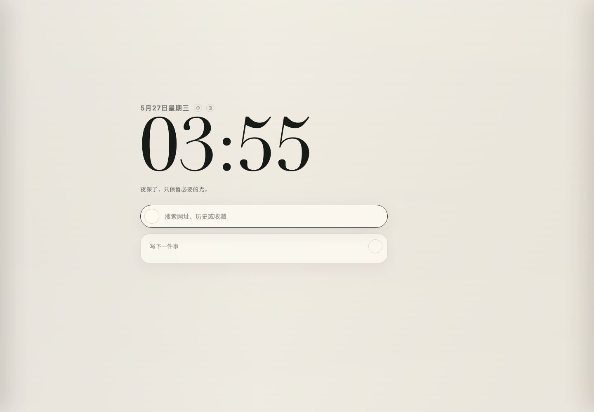

# 乔木Tab / Qiaomu Tab

> 把 Chrome 新标签页换成一个安静、漂亮、本地优先的个人工作台。

[](https://github.com/joeseesun/qiaomu-tab/stargazers)
[](https://github.com/joeseesun/qiaomu-tab/network/members)
[](https://github.com/joeseesun/qiaomu-tab/issues)
[](https://github.com/joeseesun/qiaomu-tab/commits/main)



Chrome 的默认新标签页太像一块广告牌，书签栏又总是越堆越乱。乔木Tab 想做的是另一种入口：打开浏览器时，先看到时间、今天要做的事、常用网站、最近访问、便签、天气和音乐，而不是再被一堆噪音拖走注意力。

它不是一个需要注册登录的云端效率系统。核心数据优先留在本机，界面克制，中文体验友好，适合把浏览器首页整理成一个每天都会用的轻量工作台。

## 为什么想装它

- **第一眼是安静的。** 大字号时间、细腻壁纸和浅淡卡片，让新标签页像一张干净桌面，而不是入口堆栈。
- **常用入口更顺手。** 搜索框可以搜网站、历史和收藏，也可以切换 Google、ChatGPT、豆包、Kimi、百度、Bing、DuckDuckGo。
- **浏览记录不是流水账。** 最近访问会自动按 AI、开发、工作、阅读、社交、影音、购物等类别整理，找回刚看过的页面更快。
- **待办、便签、番茄钟放在刚好够用的位置。** 不抢戏，但你需要的时候就在首页。
- **本地优先。** 自定义网站、待办、便签、设置和缓存保存在浏览器本地；不要求账号，不把你的工作台变成另一个 SaaS。
- **中文用户不用将就。** 中文界面、中文天气、微信文章标题优化、常见中文网站图标都做了适配。

## 一屏里有什么

| 区域 | 能做什么 |
| --- | --- |
| 时间与状态 | 显示日期、当前时间、每日一句，可切换浅色/深色和壁纸氛围。 |
| 搜索与 AI | 本地搜索、网页搜索、AI 搜索和 Todo 输入共用同一个入口。 |
| 今日待办 | 快速添加、完成和查看最近完成的任务。 |
| 常用网站 | 添加、编辑、删除自定义网站，自动匹配大量品牌图标。 |
| 最近访问 | 读取 Chrome 历史记录，按场景分类，并支持搜索。 |
| 收藏夹 | 读取浏览器收藏夹，作为侧栏里的快速导航。 |
| 便签 | 在新标签页上放置轻量便签，适合临时记录和整理想法。 |
| 天气 | 添加关注城市，查看实时天气、预报和出门建议。 |
| 音乐 | 内置一个小型音乐卡片，让工作台更有一点呼吸感。 |

## 适合谁

- 你每天打开很多新标签页，希望第一眼更安静。
- 你常在搜索、AI、收藏夹、最近访问之间切换。
- 你需要一点待办和便签，但不想打开完整项目管理工具。
- 你在意浏览器扩展的隐私边界，希望核心数据尽量留在本机。
- 你喜欢有设计感的工具，但不想要花哨到影响效率的首页。

## 安装体验

目前建议通过 Chrome 的开发者模式加载本地扩展。

### 1. 准备环境

- Chrome 或 Chromium
- Git
- Node.js 18+，用于重新构建便签编辑器

### 2. 克隆仓库

```bash
git clone https://github.com/joeseesun/qiaomu-tab.git
cd qiaomu-tab
```

### 3. 安装依赖并构建

```bash
npm install
npm run build:notes
```

### 4. 在 Chrome 加载

1. 打开 `chrome://extensions`
2. 开启右上角 `Developer mode`
3. 点击 `Load unpacked`
4. 选择刚刚克隆的 `qiaomu-tab` 文件夹
5. 打开一个新标签页，看到 `乔木Tab` 就可以开始使用

## 快速上手

1. 在首页搜索框输入关键词，可以搜索本地网站、历史记录和收藏夹。
2. 点击搜索框左侧图标，切换 Google、ChatGPT、豆包、Kimi 等搜索目标。
3. 用右侧侧栏管理最近访问、收藏夹和设置。
4. 点击日期旁边的小图标，快速打开番茄钟、便签、待办和音乐模块。
5. 在设置里切换语言、主题、壁纸、模块开关和最近访问数量。

## 权限说明

乔木Tab 需要一些 Chrome 权限才能把浏览器首页做成真正可用的工作台：

| 权限 | 用途 |
| --- | --- |
| `history` | 读取最近浏览历史，用于最近访问、分类和本地搜索。 |
| `bookmarks` | 读取浏览器收藏夹，用于侧栏收藏视图和搜索。 |
| `storage` | 在本地保存自定义网站、待办、便签、设置和缓存。 |
| `https://chatgpt.com/*` | 把关键词带到 ChatGPT 页面。 |
| `https://www.doubao.com/*` | 把关键词带到豆包页面。 |
| `https://www.kimi.com/*` | 把关键词带到 Kimi 页面。 |
| `https://www.google.com/*` | 搜索和 favicon 回退。 |
| `https://mp.weixin.qq.com/*` | 改善微信文章在历史记录里的标题显示。 |
| `https://v1.hitokoto.cn/*` | 获取首页每日一句。 |
| `https://restapi.amap.com/*` | 获取天气数据。 |
| `<all_urls>` | 为 favicon 回退、常见站点识别和未来兼容保留能力。 |

## 隐私边界

乔木Tab 会读取本机浏览历史和收藏夹，但这些数据默认只用于本地渲染、分类和搜索，不会上传到乔木Tab 自己的服务器。

需要注意的是，部分功能会访问第三方服务：

- 天气会请求高德天气接口。
- 每日一句会请求一言接口。
- 当你主动选择 Google、ChatGPT、豆包、Kimi 等搜索目标时，输入的关键词会发送到对应服务页面。
- 音乐模块会访问乔木音乐接口获取公开曲目。

## 本地开发

```bash
npm install
npm run build:notes
```

插件主体是原生 Chrome MV3 项目，不需要 dev server。修改 `newtab.html`、`newtab.css`、`newtab.js` 后，在 `chrome://extensions` 点击 Reload，再打开新标签页检查效果。

便签编辑器源码在 `src/note-editor.js`，构建产物是 `assets/note-editor.bundle.js`。

## 项目结构

```text
.
├── manifest.json                  # Chrome MV3 扩展清单
├── newtab.html                    # 新标签页结构
├── newtab.css                     # 首页、侧栏、天气、待办等样式
├── newtab.js                      # 新标签页主逻辑
├── background.js                  # 扩展后台脚本
├── provider-autosubmit.js         # AI 页面自动提交通用逻辑
├── chatgpt-autosubmit.js          # ChatGPT 适配
├── doubao-autosubmit.js           # 豆包适配
├── kimi-autosubmit.js             # Kimi 适配
├── src/note-editor.js             # 便签编辑器源码
├── assets/                        # 图标、壁纸、城市数据和构建产物
└── _locales/                      # 中英文扩展名称和描述
```

## 常见问题

| 问题 | 解决方式 |
| --- | --- |
| 加载后新标签页没有变化 | 确认扩展已启用，然后重新打开一个新标签页。 |
| 便签编辑器不可用 | 运行 `npm install && npm run build:notes`，确认生成了 `assets/note-editor.bundle.js`。 |
| 最近访问或收藏夹为空 | 检查扩展详情页里 `history` 和 `bookmarks` 权限是否已授权。 |
| 天气无法加载 | 确认网络可访问高德天气接口，或在代码里替换自己的高德 Web 服务 Key。 |
| AI 搜索没有自动提交 | 目标网站可能改版或拦截自动输入，可以先把关键词带到页面后手动提交。 |

## English

Qiaomu Tab is a calm, local-first Chrome MV3 new tab dashboard. It combines search, AI entry points, custom links, recent history, bookmarks, todos, notes, weather, Pomodoro, wallpapers, and a small music widget in one polished start page.

To try it, clone this repository, run `npm install && npm run build:notes`, open `chrome://extensions`, enable Developer mode, choose `Load unpacked`, and select the repository folder.

## License

MIT
